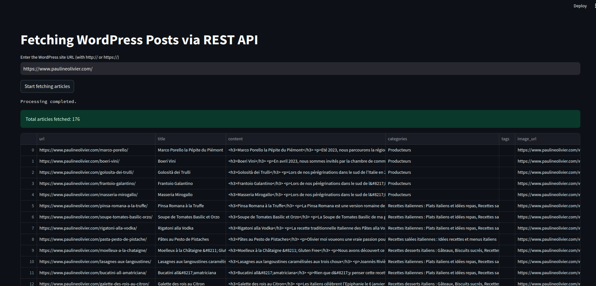

# Wordpress data extractor Streamlit

## Overview

Wordpress data extractor Streamlit is a Streamlit application that connects to any WordPress site's REST API to retrieve and export posts, categories, tags, and featured images. Users can select which data fields to include and export the results to a CSV file.

## Demo




## Features

- Fetch posts from any WordPress site via REST API.
- Selectable data fields: content, categories, tags, and images.
- Robust error handling with retry mechanisms.
- Export fetched data to a CSV file.
- Interactive Streamlit interface with progress indicators.

## Installation

1. **Clone the repository:**

   ```bash
   git clone https://github.com/drogbadvc/wordpress-data-extractor-streamlit.git
   cd wordpress-data-extractor-streamlit
   pip install -r requirements.txt
    ```
   
## Usage

```bash
streamlit run app.py
``
